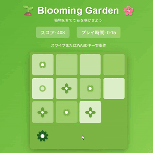

[](https://github.com/in0ho1no/2025-adhoc-blooming-garden-test)


# 🌱 Blooming Garden - 花咲く庭園 🌸

植物の成長をテーマにした2048風パズルゲーム

**🎮 今すぐプレイ: [https://in0ho1no.github.io/2025-adhoc-blooming-garden/](https://in0ho1no.github.io/2025-adhoc-blooming-garden/)**

---

## 🤖 Vibe Codingで作成

このゲームは**100% AIによって作成**されました。

- **作成方法**: Vibe Coding（自然言語での対話的プログラミング）
- **使用AI**: Claude (Anthropic)
- **開発者**: 非エンジニア
- **開発時間**: 約2時間の対話

### Vibe Codingとは？

プログラミング知識がなくても、AIとの対話だけで実用的なアプリケーションを作成できる新しい開発手法です。このプロジェクトは、**非エンジニアでも高品質なゲームを作れる**ことを実証するデモンストレーションです。

---

## 🎬 プレビュー



*植物を結合させて成長させるパズルゲーム。結合時の派手なエフェクトにも注目！*

---

## 📖 概要

同じ種類の植物を結合させて、より大きな花を咲かせていくパズルゲームです。つぼみから始まり、最終的には太陽のような輝きを放つ花まで育てることができます。

## 🔗 関連リポジトリ

- **🧪 テスト環境**: [2025-adhoc-blooming-garden-test](https://github.com/in0ho1no/2025-adhoc-blooming-garden-test)
  - 新機能の開発・検証用リポジトリ
  - 実験的な機能を試すことができます
  - デモ: https://in0ho1no.github.io/2025-adhoc-blooming-garden-test/

---

## 🎮 遊び方

### 基本操作

- **PC**: WASDキーまたは矢印キー（↑↓←→）
- **スマートフォン/タブレット**: 画面をスワイプ

### ゲームルール

1. 4×4のマスに植物タイルが表示されます
2. 上下左右にスワイプ（またはキー操作）すると、全てのタイルが指定方向に移動します
3. 同じ種類の植物が隣り合うと結合し、次の段階に成長します
4. 結合するとスコアが加算されます
5. 移動できる場所がなくなるとゲームオーバーです

### スコアリング

- 結合した植物の数値がスコアに加算されます
- 例: 2つの「32」を結合 → 「64」になり、64ポイント獲得

## 🌿 成長の段階

植物は以下の11段階で成長します：

| 段階 | 名前 | 数値 | 見た目 |
|------|------|------|--------|
| 1 | つぼみ | 2 | 小さな丸（閉じたつぼみ） |
| 2 | 芽 | 4 | 2枚の葉 |
| 3 | 若葉 | 8 | 4枚の花びら |
| 4 | 成長 | 16 | 6枚の花びら |
| 5 | 開花 | 32 | 8枚の花びら |
| 6 | 満開 | 64 | 9枚の花びら |
| 7 | 黄花 | 128 | 黄色いひまわり風の花 |
| 8 | 金花 | 256 | 金色に輝く花 |
| 9 | 橙花 | 512 | オレンジ色の光輪を持つ花 |
| 10 | 夕花 | 1024 | 夕日色の大きな花 |
| 11 | 太陽 | 2048 | 放射状の光を放つ太陽 |

## ✨ 特徴

### 🎆 結合時の派手な演出

植物が結合する瞬間を見逃しません！

- **拡大・回転アニメーション**: タイルが1.3倍に拡大し、左右に揺れる
- **光エフェクト**: 緑色の光る影が表示される
- **パーティクル**: 8方向に光の粒が飛び散る
- **0.4秒間の派手な演出**: 無音環境でも結合がはっきり分かる

### 📱 スマホ完全対応

- **スムーズなスクロール**: ページ全体を快適にスクロール可能
- **誤タップ防止**: 「新しいゲーム」ボタンを安全な位置に配置
- **タッチ最適化**: ゲーム盤面のみスワイプ反応、それ以外は通常のスクロール

### 🔓 達成システム

- 初めて特定の段階に到達すると、その段階がアンロックされます
- 未達成の段階は鍵アイコンと「???」で表示されます
- 達成状況はブラウザに保存され、次回プレイ時も維持されます

### 🏆 ランキング機能

- ゲームオーバー時、スコアが自動的にランキングに記録されます
- TOP5までのスコアとプレイ時間が表示されます
- 順位は以下のように表示されます：
  - 🥇 1位（金メダル）
  - 🥈 2位（銀メダル）
  - 🥉 3位（銅メダル）
  - 4位、5位

### 🗑️ 記録のリセット

- ランキング下部の「記録をリセット」ボタンで、達成状況とランキングを初期化できます
- 確認ダイアログが表示されるので、誤操作の心配はありません
- リセット後は即座にUIが更新されます

### ⏱️ プレイ時間計測

- ゲーム開始から終了までの時間を計測
- 「分:秒」形式で表示されます

### 🎵 サウンド

- 植物が結合する際に、軽快な音が鳴ります
- Web Audio APIを使用したプログラム生成音（音声ファイル不要）

## 🎨 デザイン

### 配色コンセプト

- **ベース**: 緑系のグラデーション（新緑を思わせる爽やかな色）
- **低レベル（2-64）**: 淡い緑から濃い緑へのグラデーション
- **高レベル（128-2048）**: 黄色→金色→オレンジ→太陽色の暖色系
- **コンセプト**: 植物の成長と太陽の温かさを表現

## 💾 データ保存

### 保存される情報

1. **達成した成長段階**
   - 一度到達した段階は永続的に記録されます
   
2. **ランキング（TOP5）**
   - スコア、プレイ時間が記録されます

### 保存場所

- ブラウザのlocalStorageに保存
- データ容量: 約1KB未満（非常に軽量）
- スマートフォンの容量への影響: 皆無

### データ削除方法

ゲーム内の「記録をリセット」ボタンを使用するのが最も簡単です。

または、ブラウザから手動で削除する場合：
1. ブラウザの設定を開く
2. 「サイトデータの削除」または「キャッシュのクリア」を実行
3. または、デベロッパーツールのコンソールで以下を実行：
```javascript
localStorage.removeItem('bloomingGarden_achievements');
localStorage.removeItem('bloomingGarden_rankings');
```

## 🌐 対応環境

### 対応デバイス

- ✅ Windows PC
- ✅ macOS
- ✅ iOS（iPhone/iPad）
- ✅ Android

### 対応ブラウザ

- Google Chrome（推奨）
- Safari
- Firefox
- Microsoft Edge

### 必要な機能

- JavaScript有効
- localStorage使用可能
- Web Audio API対応（音声再生用、非対応でもプレイ可能）

## 🚀 プレイ方法

### オンラインでプレイ

[https://in0ho1no.github.io/2025-adhoc-blooming-garden/](https://in0ho1no.github.io/2025-adhoc-blooming-garden/)

### ローカルでプレイ

`index.html`をブラウザで開くだけでプレイできます。

### 自分で公開する

公開手順の詳細は [DEPLOY.md](DEPLOY.md) をご覧ください。  
ファイルは`index.html`として提供されているため、リネーム不要でそのまま公開できます。

## 📋 技術仕様

### 使用技術

- **HTML5**: 基本構造
- **CSS3**: スタイリング、アニメーション
- **JavaScript (ES6+)**: ゲームロジック
- **SVG**: 花のアイコン生成
- **Web Audio API**: サウンド生成
- **localStorage**: データ永続化

### ファイル構成

```
index.html  # ゲーム本体（単一ファイル、すべてが含まれています）
README.md   # このファイル
DEPLOY.md   # GitHub Pagesへの公開手順
```

### コード構成

- クラスベース設計（`BloomingGarden`クラス）
- モジュール化されたメソッド
- レスポンシブデザイン対応
- タッチイベント・キーボードイベント対応

## 🎯 ゲーム攻略のコツ

1. **隅に大きな数字を配置**: 大きな植物を1つの隅に集めると、スペースを有効活用できます
2. **一方向を多用**: 特定の方向（例: 左と下）を中心に操作すると、タイルの配置が安定します
3. **次の一手を予測**: タイルがどこに出現するかを予測しながらプレイしましょう
4. **急がない**: 焦らず、じっくり考えて操作することが高スコアへの近道です

## 🎪 エンターテインメント要素

- 🌱 植物の成長を視覚的に楽しめる
- 🔓 全段階のアンロックを目指すコレクション要素
- 🏆 自己ベストを更新する達成感
- 🎨 美しい花のビジュアル
- 🎵 心地よいサウンドエフェクト

## 📝 ライセンス

このゲームは個人利用・商用利用ともに自由にお使いいただけます。

## 🤖 Vibe Codingについて

このプロジェクトは、AIとの自然言語での対話のみで作成されました。

### 開発プロセス

1. **要件定義**: 「2048風のゲームを作りたい」という簡単な説明からスタート
2. **デザイン決定**: 「植物の成長」というテーマをAIと対話しながら決定
3. **機能追加**: 「達成システムが欲しい」「演出を派手にして」などの要望を伝えるだけ
4. **問題解決**: 「スマホでスクロールできない」などの問題もAIが解決

### コーディング知識不要

- HTML/CSS/JavaScriptの知識: **不要**
- 開発環境の構築: **不要**
- デバッグ作業: **AIが実施**

### 非エンジニアでも作れる高度な機能

- SVGアニメーション
- Web Audio API（音声生成）
- localStorage（データ永続化）
- レスポンシブデザイン
- パーティクルエフェクト

このプロジェクトは、**AIの力を借りれば、誰でもクリエイターになれる**ことを示しています。

## 🙏 クレジット

- **開発**: Vibe Coding（AI対話型開発）
- **AI**: Claude (Anthropic)
- **ゲームデザイン**: 2048風パズルゲームをベースに、植物成長テーマでアレンジ
- **オリジナル2048**: Gabriele Cirulli

---

**Enjoy growing your garden! 🌻**

**Made with 🤖 Vibe Coding**